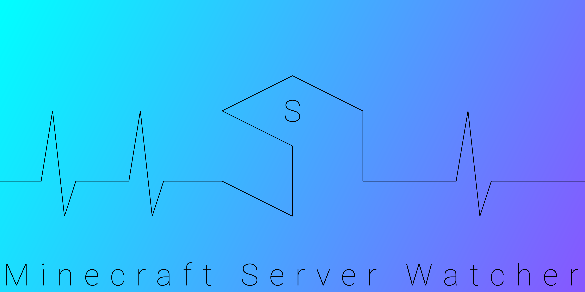

# msw-server

### Minecraft Server Watcher - Server Application
The contents of this repository represent the sources to build the server part of Minecraft Server Watcher - a free-to-use application to monitor Minecraft servers remotely. The entire application consists of the server part and the client part. This repository contains the server code (WIP: Note that the client part is **not yet** available as a public GitHub repository, but this will change in the future. It will then be linked here).

## Stack
The server application uses the programming language [Kotlin](https://kotlinlang.org/) and a bunch of official or third-party libraries and frameworks:

- [Gradle](https://gradle.org/)
- [Ktor](https://ktor.io/)
- [Tomcat](http://tomcat.apache.org/)
- [Apache HttpClient](https://hc.apache.org/httpcomponents-client-ga/)
- [Logback](http://logback.qos.ch/)
- [JsonPath](https://github.com/json-path/JsonPath)
- [Kotest](https://kotest.io/)
- [Λrrow](https://arrow-kt.io/)
- [Guava](https://github.com/google/guava)
- [kotlinx-serialization](https://github.com/Kotlin/kotlinx.serialization)
- [Allure](https://github.com/allure-framework)
- [Pitest](https://pitest.org/)
- [kapt](https://kotlinlang.org/docs/reference/kapt.html)

# WIP Notice
This project is currently Work In Progress. To be precise, it is at the very beginning of development. The current sourcecode only contains fractions of the final state of the application. Any content of this repository, including documentation and this very file, can be subject to drastic changes until this project reaches somewhat of an "alpha phase". Documentation will subsequently be added to this file and the [Wiki](https://github.com/RaphaelTarita/msw-server/wiki).
